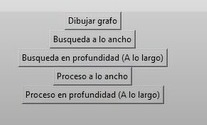

202300653 -	Francisco Gerardo Castillo Sagastume
202300400 -	Iker Renato Barrios Portillo
202300778 -	Sharon Melissa Santa Cruz Huertas
202300652 -	Vasti Abigail González Pereira
202302190 -	Carlos Fernando Matta Peña

# Manual de Usuario de Algoritmo de Búsqueda Proyecto MC2 

## Objetivos del Sistema

#### General 

Guiar al usuario en el uso, manejo y comprensión del programa que muestra gráficamente el funcionamiento de los grafos. 

#### Específicos 

* Instruir al usuario en el esbozo y edición de un grafo. 
* Orientar en el funcionamiento del programa para que el usuario interactúe de manera eficaz con las variadas herramientas. 

## Introducción 
La teoría de grafos es fundamental en los campos tecnológicos, pero es aplicable a los campos que estén relacionados a conexiones, es decir, que establezcan una red o busquen caminos. No todos los usuarios que plantean estas conexiones tienen conocimiento profundo sobre los algoritmos utilizados, tal como el de búsqueda a lo largo y ancho.  El manual de usuario se enfoca de explicar de manera simple y sintetizada el funcionamiento gráfico de los algoritmos de búsqueda. Además, presenta los requisitos para poder instalar el programa para que funcione de manera óptima. 

## Información del Sistema
La funcionalidad del programa empieza desde diseñar un grafo desde cero, es decir, establecer los puntos de conexión (vértices), las líneas que los conectan (aristas) y agregar el valor o peso de estas. Se elige la finalidad de cada algoritmo, es decir, si quieren que el programa muestre la búsqueda a lo largo o a lo ancho. Asimismo, aparte de este cometido, puede editarse estéticamente, es decir, puede cambiarse el color tanto del fondo como el grafo formado, cada proceso se detalla a lo largo de este manual. 

## Requisitos del Programa
#### Hardware
* Poseer procesador de doble núcleo o superior
* Se recomienda disponer de al menos 2 GB de RAM. 
#### Software
* **Python:** Un entorno de desarrollo de Python para la realización de dicha aplicación. 
* **IDE Visual Studio Code:** Para la realización del código se necesita un IDE para desarrollar el código.  

# Flujo de Funcionalidades del Sistema 

### Vértices 
Los vértices son los puntos donde se encuentran dos o más objeto unidimensionales, en caso de los grafos serían las aristas. En la parte superior se localiza el espacio para ingresar la denominación de los vértices que se deseen. Para que aparezca en el plano, se debe clickear "Dibujar grafo".

  

     

 
#### Aristas
Línea que une a dos vértices, puede tener peso o valor. Para estas, se ingresa ambos vértices que estarán conectados, luego igual que con los vértices para que aparezca en el plano, se clickea "Dibujar grafo". 

 

 

#### Aplicación de Algoritmos 
En la parte inferior se encuentran los botones de los diferentes algoritmos de búsqueda, según lo que se requiera se selecciona uno de las siguientes opciones para que en el plano se muestre el árbol minimal usando el bosquejo del grafo antes realizado. 
* **Búsqueda a lo Ancho** 
* **Búsqueda en Profundidad (a lo largo)**
* **Proceso a lo Ancho** 
* **Proceso en profundidad (A lo largo)** 

 

Al seleccionar cualquiera de estos algoritmos, el resultado o simulación se muestra en una ventana emergente de cómo va recorriendo cada nodo hasta realizar el recorrido completo. 
 
Link video: https://drive.google.com/file/d/1vjZ96zvVSnUyctjGDy9wX7biOyqNUSw4/view?usp=drive_link 

[def]: /images/picture.jpg